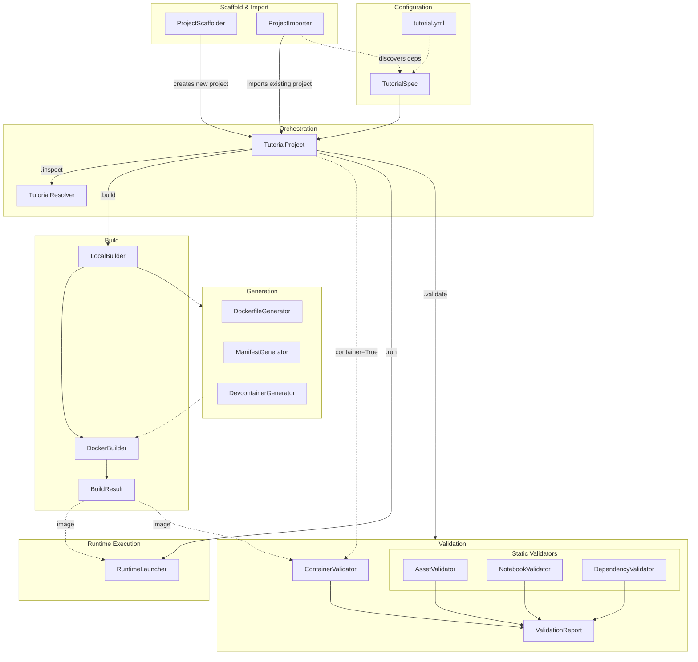

# Architecture & Design

`tutorial-sdk` separates **content assets**, **runtime environments**, and **build orchestration**. It treats tutorials as structured software packages rather than ad-hoc configurations of notebooks and environment setups.

---

## Modular Layout

The internal architecture divides duties across clear modules, ensuring high testability, predictable builds, and structured validation.



| Pipeline Layer | Core Module | Architectural Duty |
| :--- | :--- | :--- |
| **Configuration** | `tutorial.yml` | Declarative package specification file defining content, build, and validation parameters. |
| | `TutorialSpec` | Strongly-typed configuration schema parser implemented with Pydantic v2 models. |
| **Scaffold & Import** | `ProjectScaffolder` | Creates new tutorial projects from built-in templates (minimal, workshop, etc.). |
| | `ProjectImporter` | Imports existing projects by scanning directories for notebooks, scripts, data, and docs; auto-extracts and cross-references dependencies from imports, install commands, requirement files, and `pyproject.toml` metadata. |
| **Orchestration** | `TutorialProject` | Central API orchestrator managing configuration parsing, build delegation (via `LocalBuilder`), validation, and runtime execution. |
| | `TutorialResolver` | Analyzes local filesystem structures, resolving relative path bounds and missing assets. |
| **Generation** | `DockerfileGenerator` | Compiles reproducible Dockerfiles from tutorial specifications. |
| | `ManifestGenerator` | Exports build manifest records (`tutorial-manifest.json`) for package traceability. |
| | `DevcontainerGenerator` | Synthesizes `.devcontainer/devcontainer.json` configuration structures for localized environments. |
| **Build** | `LocalBuilder` | Orchestrates pre-build tasks (Dockerfile generation, manifest and devcontainer records) and delegates container compilation to `DockerBuilder`. |
| | `DockerBuilder` | Directs local platform container compilation, image tagging, and layer caching configuration. |
| | `BuildResult` | Represents the outcome of a container build, encapsulating the compiled image tag, Dockerfile path, and build status. |
| **Validation** | `AssetValidator` | Performs static checks on declared scripts, local datasets, and documents. |
| | `NotebookValidator` | Parses notebook nodes, highlighting pre-existing execution exceptions or traceback errors. |
| | `DependencyValidator` | Checks whether declared pip packages are locally importable via `importlib`, generating warnings for unavailable modules. |
| | `ContainerValidator` | Performs live sandbox container boot checks and JupyterLab verification hooks. |
| | `ValidationReport` | Formulates structured validation outputs, combining specific validation checks, warnings, and errors. |
| **Runtime Execution** | `RuntimeLauncher` | Launches container environments locally, mapping host ports and optionally providing interactive shell access. |


### 1. Configuration Layer (`spec.py`, `config.py`)
- **`spec.py`**: Defines structured, strongly-typed schemas using **Pydantic v2** models (`TutorialSpec` and its nested sub-specifications).
- **`config.py`**: Provides loading helpers (`load_config`) to parse declarative `tutorial.yml` specifications, performing strict field validation and custom schema checks.

### 2. Scaffold & Import Layer (`scaffold/`)
- **`templates.py`**: Defines `ProjectScaffolder`, which creates new tutorial projects from built-in templates (`minimal`, `notebook-tutorial`, `workshop`, `lab-exercise`, `demo`). Each template produces a ready-to-use directory layout with stub notebooks and a populated `tutorial.yml`.
- **`importer.py`**: Defines `ProjectImporter`, which scans an existing directory (local, remote Git URL, or GitHub `ORG/REPO`) to auto-detect notebooks, scripts, data files, and documentation. Python version is inferred from `.python-version` or `pyproject.toml`. Remote clones are persisted next to the target directory by default for inspection; pass `remove_clone=True` to delete them after import. The result is a fully populated `tutorial.yml` and a copy of discovered files in the target directory.

#### Dependency Detection

The importer collects Python dependencies from multiple sources and **cross-references** them to resolve module-name vs PyPI-package mismatches:

- `import` / `from ... import` statements in notebook code cells (AST-parsed);
- `%pip install`, `!pip install`, `%conda install`, `!conda install`, `%uv pip install`, `!uv pip install` commands in cells;
- `requirements.txt` and `requirements/*.txt` files;
- `pyproject.toml` `[project].dependencies` and `[project].optional-dependencies` (`[project].name` is included as an installable dependency).

Authoritative names from `pyproject.toml`, install commands, and requirements files take precedence over AST-derived import names. For example, if a notebook has `import rhapsody` but the `pyproject.toml` declares `project.name = "rhapsody-py"`, only `rhapsody-py` appears in the final dependency list.

### 3. Orchestration Layer (`project.py`, `resolver.py`)
- **`project.py`**: Defines `TutorialProject`, the primary programmatic API and central orchestrator of the SDK. It coordinates resolution, static and container validation, Dockerfile and configuration generation, compilation, and environment executions. Provides `init_from()`, `init_from_url()`, and `init_from_github()` class methods for importing existing projects.
- **`resolver.py`**: Defines `TutorialResolver` and `ResolvedTutorialProject`. It analyzes declared content assets against the physical filesystem layout, resolving project-relative paths and tracking missing resources before triggering validation or compilation steps.

### 4. Generation Layer (`generator/`)
- **`dockerfile.py`**: Compiles deterministic Dockerfiles configured with customizable snippet injections, `apt` and `pip` dependencies, local package installs, optional conda dependency comments, content copy rules, and runtime JupyterLab, shell, or command entrypoints.
- **`devcontainer.py`**: Synthesizes custom VS Code `.devcontainer/devcontainer.json` environment settings for seamless local containerized development.
- **`manifest.py`**: Generates a standard reproducibility catalog (`tutorial-manifest.json`) capturing environment specs, content declarations, and image tags for distribution and tracking.

### 5. Build Layer (`builder/`)
- **`docker.py`**: Defines `BuildResult` and the `DockerBuilder` helper, executing container builds locally using standard docker build tooling, handling user platform settings, layer caches, tag outputs, and compilation error capture.
- **`local.py`**: Features `LocalBuilder`, orchestrating pre-build tasks (generating the target Dockerfile and any required manifest or devcontainer records) in order to package and prep resources cleanly before launching compilation executors.

### 6. Validation Layer (`validator/`)
- **`assets.py` / `notebooks.py` / `dependencies.py`**: Run static inspections on local file references, scan Jupyter Notebook nodes for pre-existing run execution tracebacks or exceptions, and evaluate target python dependency sets against imports.
- **`container.py`**: Powers live, containerized validation checks by launching built images asynchronously in the background and executing verification suites inside (e.g., verifying that JupyterLab launches successfully).
- **`report.py`**: Formulates structured validation outputs, combining specific `ValidationCheck` instances into a unified `ValidationReport`.

### 7. Runtime Execution Layer (`runtime/`)
- **`launcher.py`**: Implements `RuntimeLauncher`, which maps host ports and executes container runtime engines locally, spinning up active environments with interactive JupyterLab servers or fallback terminal sessions.

---

## The Container Validation Model

A major architectural pillar of `tutorial-sdk` is the live **Container Validation** system. Unlike standard static linters, the validation pipeline operates on two distinct layers:

### Local Static Validation
1. **Asset Checks**: Verifies that every single declared file and dataset is located at the specified path in the project workspace.
2. **Import Integrity**: Performs localized dry-run module checks for import-like pip packages, generating warnings for packages that are missing from the current interpreter.
3. **Stored Notebook Checks**: Parses notebook JSON fields to check for existing cell execution exceptions or stack traces.

### Live Container Validation
When `--container` is triggered, or during CI in `test` / `all` modes after a build:
1. Spawns the built Docker container asynchronously in the background (`docker run -d`).
2. Confirms that the environment boots successfully and registers the running process.
3. Spawns an internal execution hook inside the container (`docker exec ... jupyter lab --version`) to verify that the core JupyterLab suite is fully installed and available.
4. Cleans up all generated resources safely under all circumstances.

---

## Extension & Escape Hatches

The SDK provides controlled override blocks for custom steps, allowing authors to inject customized commands into generated Dockerfiles without having to modify the generated files by hand:

```yaml
build:
  custom_sections:
    before_dependencies: docker/before-deps.Dockerfile
    after_dependencies: docker/after-deps.Dockerfile
    before_entrypoint: docker/before-entry.Dockerfile
```
These snippets are safely read by `DockerfileGenerator` and seamlessly compiled into the final Dockerfile generation pipeline.
