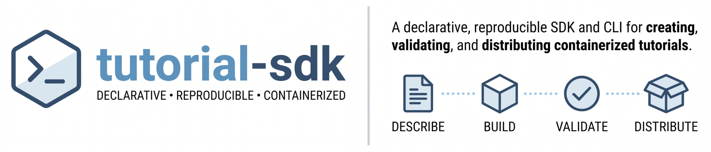

# 

A **declarative, reproducible tutorial packaging system** and command-line tool that bridges the gap between technical content and stable containerized runtimes.

`tutorial-sdk` moves technical content creators from hand-crafted Dockerfiles, floating dependencies, and loose notebooks to structured, reproducible tutorial package management. A single, Pydantic-validated `tutorial.yml` declares the full tutorial surface — metadata, contents, package environments, and validation rules — while the SDK synthesizes deterministic Dockerfiles, runs notebook-aware local and container validation, integrates with GitHub Actions via `tutorial-sdk ci`, and provides scaffolding templates for workshops, course modules, or custom lab exercises.

---

## Installation

Install `tutorial-sdk` from PyPI:

```bash
pip install tutorial-sdk
```

### Development Install

To install in editable development mode (for contributing or local development):

```bash
# Clone the repository
git clone https://github.com/bnl-peso-hub/tutorial-sdk.git
cd tutorial-sdk

# Install in development mode with test and formatting extras
SETUPTOOLS_SCM_PRETEND_VERSION=0.1.0 pip install -e ".[dev]"
```

> **Note:** `tutorial-sdk` uses [setuptools-scm](https://github.com/pypa/setuptools-scm) to derive its version from git tags. On a fresh clone without a release tag, `setuptools-scm` cannot determine the version automatically. Setting `SETUPTOOLS_SCM_PRETEND_VERSION` provides a fallback version for the local install.

---

## Quickstart

Get up and running in a few simple steps.

### 1. Initialize a Project
Create a new tutorial project from the built-in minimal template:
```bash
tutorial-sdk init my-new-tutorial
cd my-new-tutorial
```

### 2. Verify Specs and Contents
Inspect the resolved configuration structure and assets:
```bash
tutorial-sdk inspect
```

### 3. Validate, Build, and Run
Validate all declared notebook files, dependencies, and paths locally, then compile the container environment:
```bash
# Validate local specs, files, and imports
tutorial-sdk validate

# Generate the Dockerfile and build the image
tutorial-sdk build

# Spin up the JupyterLab server inside the container locally
tutorial-sdk run
```

---

## Project Structure

A typical `tutorial-sdk` managed repository looks like this:

```text
my-tutorial/
  ├── tutorial.yml        # Source of truth specification
  ├── Dockerfile          # Deterministic generated artifact
  ├── README.md           # Instructional document
  ├── notebooks/
  │   └── 01-intro.ipynb  # Interactive tutorials
  ├── data/
  │   └── dataset.csv     # Accompanying datasets
  └── scripts/
      └── helpers.py      # Python utility modules
```

> **Note:** Generated artifacts include: (a) `tutorial-manifest.json` — full details of the resulted tutorial package (dependencies, content, validation rules, etc.); (b) `tutorial-validation.json` — automated validation check report (Warnings and Errors).
